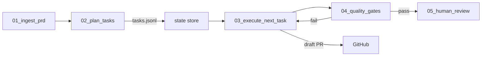

# AI Dev Tasks — Agent‑Aligned (n8n + OpenAI GPT‑5)

A lightweight, repeatable workflow for planning, executing, and shipping features with AI—usable by humans in AI IDEs and by autonomous agents (n8n + OpenAI GPT‑5).

- **Human flow:** `create-prd.md → generate-tasks.md → process-task-list.md`
- **Agent flow:** Same stages, plus machine‑readable tasks, state, tool contracts, quality gates, and budgets.

---

## Why this exists

Large, single prompts are brittle. This repo enforces **small, checkable steps** with clear success criteria. For agents, we add:

- A **Task JSON Schema** the model must output
- A **Return Envelope** for every agent action
- **State & transitions** so runs are resumable/idempotent
- **Tool contracts (OpenAPI)** for GitHub, filesystem, tests, evals
- **Quality gates (CI)** before merge
- **Budgets/rate‑limits** to keep costs safe and predictable

---

## Repository layout

```text
/
├─ create-prd.md
├─ generate-tasks.md
├─ process-task-list.md
├─ specs/
│  ├─ Task.schema.json
│  ├─ ReturnEnvelope.schema.json
│  └─ Prd.schema.json
├─ docs/
│  ├─ agent-contract.md
│  └─ prompts/
│     ├─ system.md
│     ├─ create-prd.agent.md
│     ├─ generate-tasks.agent.md
│     └─ process-task-list.agent.md
├─ tools/
│  ├─ github.yaml
│  ├─ fs.yaml
│  ├─ test.yaml
│  └─ eval.yaml
├─ n8n/
│  ├─ 01_ingest_prd.json
│  ├─ 02_plan_tasks.json
│  ├─ 03_execute_next_task.json
│  ├─ 04_quality_gates.json
│  └─ 05_human_review.json
├─ state/
│  └─ tasks.jsonl           # runtime (gitignored)
├─ scripts/
│  ├─ state-upsert.mjs
│  ├─ state-resume.mjs
│  └─ state-transition.mjs
├─ config/budget.json
├─ .github/workflows/agent-checks.yml
├─ eval/rubrics/basic.json
└─ sample-app/ (tiny project for CI checks)
```

---

## Quickstart

### Requirements
- n8n (cloud or self‑hosted), Node 18+
- OpenAI API key with access to **GPT‑5** models
- GitHub repo + PAT (scopes: `repo`, `workflow` recommended)

### 1) Human‑in‑the‑loop (any AI IDE)
1. Open your IDE agent (Cursor, Claude Code, etc.).
2. Reference the prompts:  
   - Create PRD with `@create-prd.md`  
   - Plan with `@generate-tasks.md`  
   - Execute with `@process-task-list.md`
3. Approve/iterate task‑by‑task.

### 2) Agent‑mode (n8n)
1. Import `/n8n/*.json` (workflows).
2. Set credentials: `OPENAI_API_KEY`, `GITHUB_TOKEN`, `REPO_OWNER`, `REPO_NAME`, `DEFAULT_BRANCH`.
3. Run **02_plan_tasks** → generates/validates Tasks (JSON) and upserts into `/state/tasks.jsonl`.
4. Run **03_execute_next_task** → executes next runnable Task, returns a **Return Envelope**, opens a **draft PR**.
5. **04_quality_gates** must pass before **05_human_review** merges.

---

## Model routing (nano‑first)

By default, all steps use **gpt‑5‑nano**. The router escalates to **gpt‑5** only when:

- schema validation fails twice,
- estimated diff > 150 lines,
- test‑repair loops ≥ 2,
- input token estimate > 12k for the step.

See [`config/budget.json`](config/budget.json).

---

## Architecture



---

## Task JSON Schema (canonical)

All agent‑generated tasks must conform to [`/specs/Task.schema.json`](specs/Task.schema.json).

```json
{
  "$id": "https://hometechhq.github.io/ai-dev-tasks/specs/Task.schema.json",
  "$schema": "https://json-schema.org/draft/2020-12/schema",
  "title": "Task",
  "type": "object",
  "required": ["id", "title", "status", "priority", "type", "inputs", "acceptanceCriteria"],
  "properties": {
    "id": { "type": "string" },
    "parentId": { "type": ["string", "null"] },
    "title": { "type": "string" },
    "description": { "type": "string" },
    "status": { "type": "string", "enum": ["Planned", "InProgress", "Review", "Done", "Blocked"] },
    "priority": { "type": "string", "enum": ["P0", "P1", "P2", "P3"] },
    "type": { "type": "string", "enum": ["Code", "Docs", "Test", "Design", "Infra", "Research", "Refactor"] },
    "deps": { "type": "array", "items": { "type": "string" } },
    "assignee": { "type": "string" },
    "labels": { "type": "array", "items": { "type": "string" } },
    "inputs": { "type": "object" },
    "outputs": { "type": "object" },
    "artifacts": { "type": "array", "items": { "type": "string" } },
    "acceptanceCriteria": { "type": "array", "items": { "type": "string" } },
    "checklist": { "type": "array", "items": { "type": "string" } }
  },
  "additionalProperties": false
}
```

**Example Task**
```json
{
  "id": "TASK-001",
  "title": "Add /health endpoint",
  "description": "Expose GET /health returning {status:'ok'}",
  "status": "Planned",
  "priority": "P2",
  "type": "Code",
  "deps": [],
  "labels": ["backend", "api"],
  "inputs": { "path": "/health" },
  "outputs": {},
  "acceptanceCriteria": ["200 OK", "JSON body includes status:'ok'"],
  "checklist": ["unit test added", "route registered"]
}
```

---

## States & transitions

| From       | Allowed To                    |
|-----------|--------------------------------|
| Planned   | InProgress, Blocked            |
| InProgress| Review, Blocked                 |
| Review    | Done, InProgress               |
| Blocked   | InProgress                     |
| Done      | —                              |

Transitions are enforced by helper scripts and/or n8n nodes.

---

## Agent Return Envelope

Every task execution returns a single JSON object the orchestrator can parse.  
**Schema:** [`/specs/ReturnEnvelope.schema.json`](specs/ReturnEnvelope.schema.json)

```json
{
  "taskId": "TASK-001",
  "status": "InProgress | Review | Blocked | Done",
  "actions": [
    { "tool": "fs.write", "args": { "path": "src/health.ts", "contents": "..." }, "resultRef": "w1" },
    { "tool": "github.pr_create", "args": { "title": "feat: health endpoint", "head": "feat/TASK-001-health", "base": "main", "body": "..." }, "resultRef": "pr1" }
  ],
  "artifacts": ["coverage/coverage.xml", "junit.xml"],
  "notes": "Implemented route, added tests.",
  "next": "If tests fail, add dependency injection to server."
}
```

- `status` reflects post‑action state for this task.
- `actions[].resultRef` lets later steps fetch tool outputs.

---

## Tool contracts (OpenAPI)

The agent doesn’t shell out. It calls **allow‑listed tools** in `/tools/*.yaml`.

- `tools/github.yaml` → PRs & comments (`github.pr_create`, `github.comment_create`)
- `tools/fs.yaml` → read/write/apply_patch
- `tools/test.yaml` → run unit tests (produces JUnit/coverage)
- `tools/eval.yaml` → semantic rubric checks

---

## State store

- Location: `/state/tasks.jsonl` (newline‑delimited JSON, .gitignored)
- Helpers:
  - `state-upsert` → idempotently upserts tasks
  - `state-resume` → yields next runnable task (no unmet `deps`)
  - `state-transition` → enforces valid moves

---

## Quality gates (CI)

`.github/workflows/agent-checks.yml` runs on PRs from agent branches:

- Unit tests (produce JUnit)
- Linters/formatters
- Coverage (Cobertura/LCOV)
- Static checks (regex/AST)
- Semantic eval (LLM rubric; returns strict JSON)

Branch protection requires all checks to pass before merge.

---

## Budgets & rate limits

- `config/budget.json` defines caps per model & per task
- Retry policy: exponential backoff + jitter
- Agents must **stop or escalate** model when caps are exceeded

---

## Security & compliance

- Allow‑listed tools only; **no arbitrary shell**
- **Draft PRs** + feature branches by default
- Least‑privilege GitHub PAT scopes
- Secrets managed in n8n credentials vault
- Provenance: actions + results logged per task

---

## Human‑first prompts (still here!)

Keep using:
- `create-prd.md` → PRD
- `generate-tasks.md` → JSON Tasks (schema above)
- `process-task-list.md` → execute tasks, emit Return Envelope

> For agents, use the JSON‑only versions in `/docs/prompts/`.

---

## License

Apache‑2.0
