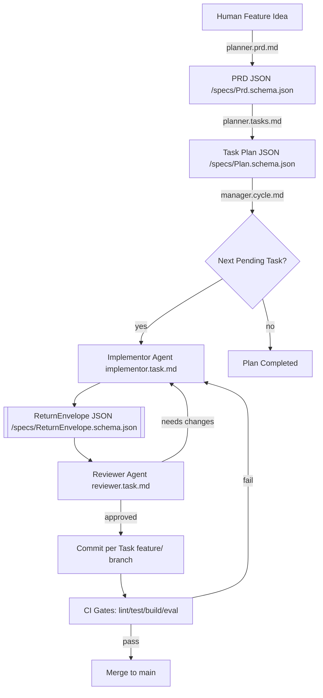
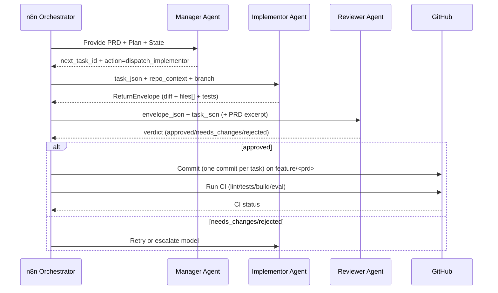
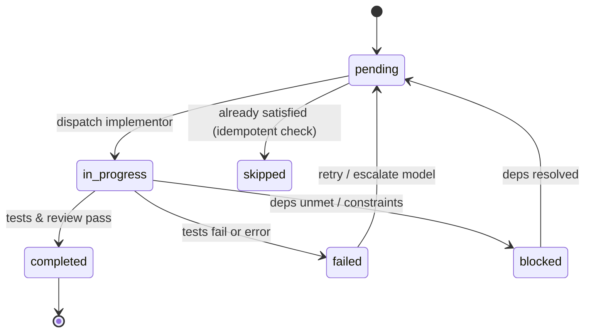
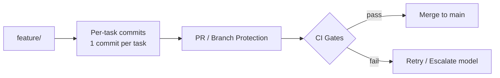

# AI Dev Tasks

Structured, **n8n-orchestrated** multi-agent development pipeline.  
Human idea → **PRD (JSON)** → **Task Plan (JSON)** → **Implementor tasks (Return Envelopes)** → **Review & CI gates** → Merge.

---

## 1) Architecture at a glance



---

## 2) Orchestrated sequence (per task)



---

## 3) State & idempotency (task lifecycle)



- Orchestrator always resumes by **reading the plan** and picking the **first `pending` task** whose dependencies are satisfied.  
- Each run writes a **ReturnEnvelope** to `/state/runs/<run-id>/task-<id>.json`.  
- Idempotency rule: Implementor must **skip** if acceptance criteria are already met.

---

## 4) Repository layout

```
/specs/          JSON Schemas (authoritative)
  ├─ Prd.schema.json
  ├─ Plan.schema.json
  └─ ReturnEnvelope.schema.json

/docs/prompts/   Agent-facing JSON-first prompts (orchestrated mode)
  ├─ planner.prd.md
  ├─ planner.tasks.md
  ├─ implementor.task.md
  ├─ reviewer.task.md
  └─ manager.cycle.md

/state/          Runtime state (gitignored)
  ├─ plan.json                 # active plan instance
  └─ runs/<run-id>/task-*.json # per-task ReturnEnvelopes

/n8n/            Orchestrator workflows (nodes/pipelines)
/tools/          OpenAPI tool contracts (fs, github, tests, eval)
/scripts/        State helpers (resume, transition, GC)
/eval/           Rubrics for semantic eval (optional)
/sample-app/     Example target app for CI (can move to /examples/)
```

---

## 5) Data model contracts (schemas)

1. **PRD** → `/specs/Prd.schema.json`  
   1.1 Machine-readable product requirements (objectives, requirements, acceptance, risks).  
2. **Task Plan** → `/specs/Plan.schema.json`  
   2.1 Hierarchical tasks with `depends_on`, acceptance, routing, gates.  
3. **Return Envelope** → `/specs/ReturnEnvelope.schema.json`  
   3.1 **Option C**: human-readable `diff` + authoritative `files[]` (base64), `tests`, `costs`, `notes`.  

Agents must output **only fenced JSON** validating against these schemas.

---

## 6) Branch, commit, and CI policy



6.1 **One feature branch per PRD** (e.g., `feat/login-2025-08`).  
6.2 **One commit per task**; message: `Task <id>: <title>`.  
6.3 **Required CI gates** (GitHub Actions):  
6.3.1 Lint, unit tests (and build if relevant).  
6.3.2 Optional static security & semantic eval.  
6.4 Reviewer agent (or human) must approve before merge.

---

## 7) n8n orchestration notes

7.1 **Manager** finds the next `pending` task (deps satisfied).  
7.2 **Implementor** applies constrained edits and runs gates.  
7.3 **Reviewer** validates diffs/tests and acceptance.  
7.4 **State**: envelopes saved under `/state/runs/<run-id>/task-<id>.json`.  
7.5 **Resilience**: safe to restart flows — the manager re-derives state from files.  
7.6 **Model routing**: default implementor = `gpt-5-nano`; escalate to `gpt-5-mini` on failure.  
7.7 **Budgets** (optional): plan-level `max_usd` and `max_calls` for observability/guardrails.

---

## 8) Tooling & safe I/O (OpenAPI contracts)

- **fs**: read/query specific files, write patches via `files[]` from the envelope.  
- **github**: create branches/commits/PRs, run checks.  
- **tests**: run `pytest -q` (or project default), capture reports.  
- **eval**: optional rubric-based semantic checks (e.g., `/eval/rubrics/basic.json`).  
Agents **ask**; orchestrator executes — prevents unsafe shell actions.

---

## 9) Garbage collection & audit

9.1 Runtime artifacts in `/state/` are **gitignored** for speed.  
9.2 At the **end of a cycle**, snapshot run summaries to `/docs/runs/<prd-id>/` (optional).  
9.3 At the **start of the next PRD**, run `/scripts/gc-runs.mjs` to prune old `/state/runs/*`.

---

## 10) Quickstart

10.1 **Orchestrated (recommended)**  
10.1.1 Run `planner.prd.md` → PRD JSON.  
10.1.2 Run `planner.tasks.md` → Plan JSON (commit to `/state/plan.json`).  
10.1.3 Start cycle with `manager.cycle.md`; it dispatches tasks.  
10.1.4 Inspect per-task envelopes under `/state/runs/<run-id>/`.

10.2 **IDE (Cursor/Claude) – human-guided**  
10.2.1 Use root prompts: `create-prd.md`, `generate-tasks.md`, `process-task-list.md`.  
10.2.2 See [ide-usage.md](ide-usage.md).  
10.2.3 Note: JSON schemas/envelopes not enforced in this mode.

---

## 11) FAQ

11.1 **Do I need GitHub Issues?**  
Not required. Each PRD is its own tracked unit (branch + plan + envelopes). Issues can mirror top-level tasks for human stakeholders if desired.

11.2 **Can multiple implementors run in parallel?**  
Possible with careful partitioning (e.g., component-scoped tasks on sub-branches). Default is **sequential** for reliability and simpler merges.

11.3 **Where do costs/metrics live?**  
Each ReturnEnvelope includes `costs` (model, tokens, $). Aggregate at run end into `/state/runs/<run-id>/summary.json`.

---

## 12) Contributing

- Keep JSON changes backward-compatible with `/specs` versions.  
- Add new tool contracts under `/tools/` with clear safety limits.  
- Extend CI gates thoughtfully; prefer fast feedback.
