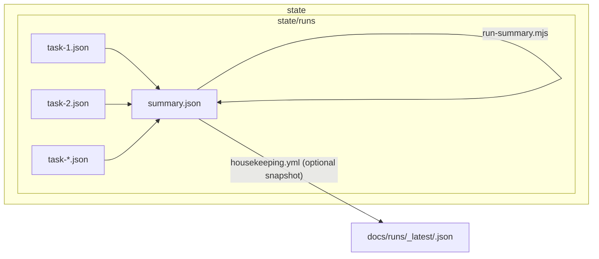

# Run Summaries & Snapshots

This folder holds **snapshotted summaries** of past implementation runs.  
Summaries are generated by `scripts/run-summary.mjs` and optionally copied here by the **housekeeping workflow**.

## Structure

- `_latest/`  
  Contains one `*.json` summary file per run id (e.g., `2025-08-29T12-34-56Z.json`).  
  These are the most recent run snapshots, useful for quick inspection and audit.  

- `<other folders>`  
  You may create subfolders for archival purposes (e.g., by project or PRD id), but `_latest/` is the default target.

## Flow (Envelopes → Summary → Snapshot)



## When is this updated?

- **Weekly**: via `.github/workflows/housekeeping.yml` (dry-run by default).  
- **Manual**: run the same workflow with `snapshot=true` to copy summaries into `_latest/`.  
- **Ad-hoc**: you can always run:
  ```
  node scripts/run-summary.mjs --state-dir ./state --all --confirm
  ```
  then copy the generated `/state/runs/*/summary.json` files into `docs/runs/_latest/` as needed.

## Why keep these?

- **Audit trail**: shows which tasks ran, when, and their outcomes.  
- **Metrics**: aggregates costs (tokens, $), test results, pass rates.  
- **Compliance**: creates a durable artifact for SOC2/ISO audits.  

## Related Files

- `/specs/ReturnEnvelope.schema.json` — schema for per-task envelopes.  
- `/scripts/run-summary.mjs` — generates summaries.  
- `/scripts/gc-runs.mjs` — garbage-collects old runs.  
- `.github/workflows/housekeeping.yml` — orchestrates summary + GC automation.

## How summaries are produced and snapshotted

1. **Per-task ReturnEnvelopes** are written under `/state/runs/<run-id>/task-*.json` during execution.  
2. **Run summaries** are generated by `node scripts/run-summary.mjs --state-dir ./state --all --confirm`, creating one `/state/runs/<run-id>/summary.json` per run.  
3. **Snapshots (optional)** are copied by the housekeeping workflow into `docs/runs/_latest/<run-id>.json` and committed, making them easy to review and durable for audit.
